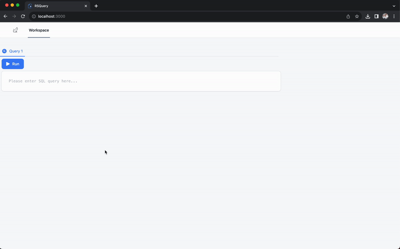

# RSQuery
[](https://github.com/Taehun/rsquery/actions/workflows/rust.yml)

Apache Ballista 분산 쿼리 엔진 인터페이스



## 시스템 아키텍처


## 시작하기

> [Rust 개발환경](https://indosaram.github.io/rust-python-book/ch1-03.html)이 필요합니다.

### 1. Ballista 의존성 라이브러리 설치
- macOS
```shell
$ brew install openssl zlib libpq cmake protobuf-c netcat curl unzip jq
```
- Ubuntu
```shell
$ sudo apt-get update && sudo apt-get install -y libssl-dev openssl zlib1g zlib1g-dev libpq-dev cmake protobuf-compiler netcat curl unzip jq
```

### 2. Apache Ballista 빌드
```shell
$ git submodule init
$ git submodule update
$ cd arrow-ballista
$ cargo build -r
$ cd ..
```

### 3. RSQuery REST API 서버 빌드
```shell
$ cargo build -r
```


### 4. 로컬 실행
> 로컬 실행은 `ballista-scheduler`, `ballista-executor`, `rsquery-restapi-server`, `web`을 각각 별도의 터미널에서 실행하시는 것을 권장합니다.

- Ballista Scheduler
```shell
$ ./arrow-ballista/target/release/ballista-scheduler
```

- Ballista Executor
```shell
$ ./arrow-ballista/target/release/ballista-executor
```

- RSQuery REST API Server
```shell
$ ./target/release/rsquery-restapi-server
```

- Web UI
```shell
$ cd web
$ pnpm run dev
```
> 웹 브라우저에서 `http://localhost:3000` 접속

### 5. 테스트
- 테이블 만들기
```shell
$ echo "1,2" > data.csv
$ curl -X POST -H "Content-Type: application/json" \
    -d '{"query": "CREATE EXTERNAL TABLE foo (a INT, b INT) STORED AS CSV LOCATION \"data.csv\""}' \
    http://localhost:8080/api/query | jq "."
```

- 결과
```json
{
  "message": "Query job is completed",
  "res_type": "message",
  "result": {
    "total_rows": 0,
    "schema": {
      "fields": [],
      "types": []
    },
    "columns": []
  }
}
```

- 테이블 탐색
```shell
$ curl -X POST -H "Content-Type: application/json" \
    -d '{"query": "SELECT * FROM foo"}' \
    http://localhost:8080/api/query | jq "."
```

- 결과
```json
{
  "message": "success",
  "res_type": "table",
  "result": {
    "total_rows": 1,
    "schema": {
      "fields": [
        "a",
        "b"
      ],
      "types": [
        "Int32",
        "Int32"
      ]
    },
    "columns": [
      [
        1
      ],
      [
        2
      ]
    ]
  }
}
```

## 쿠버네티스 클러스터에 배포

- 쿠버네티스 환경에 Ballista를 배포하는 것은 [Developer's Guide](https://github.com/apache/arrow-ballista/blob/main/CONTRIBUTING.md#developers-guide) 문서와 [Deploying Ballista with Kubernetes](https://arrow.apache.org/ballista/user-guide/deployment/kubernetes.html) 문서를 참고하시기 바랍니다.
- RSQuery REST API 서버는 `docker build -t <Registry URI>:<TAG> .` 커맨드로 빌드 후 `docker push <Registry URI>:<TAG>` 커맨드로 컨테이너 레지스트리에 푸쉬후 쿠버네티스 클러스터 배포하시면 됩니다. 아래는 EKS 배포 샘플 YAML 파일 내용입니다:

```yaml
apiVersion: apps/v1
kind: Deployment
metadata:
  name: rsquery-api-server
spec:
  replicas: 1
  selector:
    matchLabels:
      app: rsquery-api-server
  template:
    metadata:
      labels:
        app: rsquery-api-server
    spec:
      containers:
        - name: rsquery-api-server
          image: <YOUR_REGISTRY_URI>:<TAG>
          ports:
            - containerPort: 8080
          env:
            - name: BALLISTA_URL
              value: <BALLISTA_SCHEDULER_URL>
---
apiVersion: v1
kind: Service
metadata:
  name: rsquery-api-server
spec:
  type: LoadBalancer
  ports:
    - port: 80
      targetPort: 8080
      name: serving-port
  selector:
    app: rsquery-api-server
---
apiVersion: networking.k8s.io/v1
kind: Ingress
metadata:
  name: ingress-rsquery
  annotations:
    alb.ingress.kubernetes.io/scheme: internet-facing
    alb.ingress.kubernetes.io/target-type: ip
    alb.ingress.kubernetes.io/listen-ports: '[{"HTTP": 80}, {"HTTPS":443}]'
    alb.ingress.kubernetes.io/certificate-arn: arn:aws:acm:<REGION>:<AWS_ACCOUNT>:certificate/<ARN>
    alb.ingress.kubernetes.io/ssl-redirect: '443'
    alb.ingress.kubernetes.io/healthcheck-path: /health
    alb.ingress.kubernetes.io/healthcheck-interval-seconds: '60'
spec:
  ingressClassName: alb
  rules:
    - http:
        paths:
        - path: /
          pathType: Prefix
          backend:
            service:
              name: rsquery-api-server
              port:
                number: 80

```